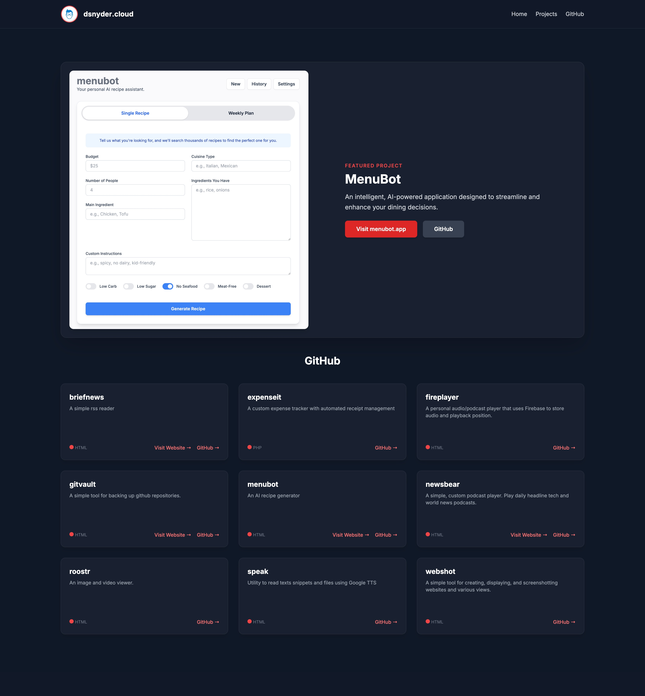

# Personal Portfolio Website: dsnyder.cloud

This repository contains the source code for my personal portfolio website, dsnyder.cloud. It's a single-page application designed to showcase my software development projects by dynamically fetching and displaying my public repositories from GitHub.

## Features

* **Dynamic Project Showcase**: Automatically fetches and displays my public GitHub repositories using the GitHub API. Repositories like `dsnyder.cloud` and `davidsnyder-nc.github.io` are filtered out.

* **Featured Project Section**: Highlights a specific project (MenuBot) with a larger image and direct links.

* **Interactive README Modal**: Users can click a "More Info" button on any project to view its `README.md` file directly on the page in a clean, readable modal window, powered by the native HTML `<dialog>` element.

* **Markdown Rendering**: The `README.md` files are fetched as Markdown and rendered into HTML using the Marked.js library, correctly displaying formatted text, images, and code blocks.

* **Responsive Design**: The website is fully responsive and designed to look great on all devices, from mobile phones to desktops, using Tailwind CSS.

* **Engaging Animations**: Subtle animations on page load, scroll, and hover are used to create a more engaging user experience.

## Technologies Used

* **HTML5**: For the structure and content of the website.

* **Tailwind CSS**: For all styling and responsive design.

* **JavaScript (ES6+)**: For all dynamic functionality, including API calls, DOM manipulation, and event handling.

* **Marked.js**: A lightweight library used to parse Markdown from README files and render it as HTML.

* **GitHub API**: To fetch repository data dynamically.

## Setup

To run this website locally, you can simply open the `index.html` file in your web browser. There are no build steps or dependencies to install.

1. Clone the repository:

   ```
   git clone [https://github.com/davidsnyder-nc/dsnyder.cloud.git](https://github.com/davidsnyder-nc/dsnyder.cloud.git)
   
   ```

2. Navigate to the project directory:

   ```
   cd dsnyder.cloud
   
   ```

3. Open `index.html` in your favorite browser.

## How It Works

The core logic is contained within the `<script>` tag in `index.html`.

1. **Fetch Repositories**: On page load, an asynchronous `fetchRepos` function makes a request to the GitHub API endpoint for the user `davidsnyder-nc`.

2. **Filter and Sort**: The returned list of repositories is filtered to exclude the portfolio repository itself and then sorted alphabetically.

3. **Generate Project Cards**: The script iterates through the filtered list and dynamically creates a card for each project, populating it with the repository's name and description.

4. **Handle "More Info" Clicks**: An event listener is attached to each "More Info" button. When clicked, it calls the `showReadmeModal` function, passing the repository's name.

5. **Display README**: The `showReadmeModal` function:

   * Opens the `<dialog>` element.

   * Fetches the `README.md` file for the specified repository from the GitHub API.

   * The content, which is returned in Base64 encoding, is decoded.

   * The decoded Markdown is passed to `marked.parse()` to convert it into HTML.

   * The resulting HTML is injected into the modal's body.

   * The script also ensures that any relative image paths in the README are converted to absolute URLs so they display correctly.

<br><br>
